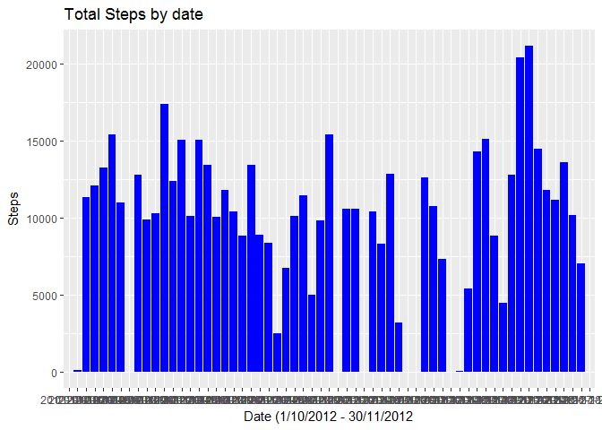
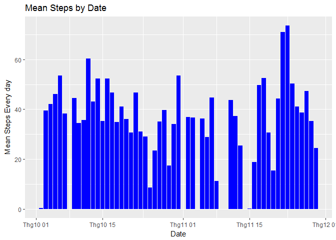
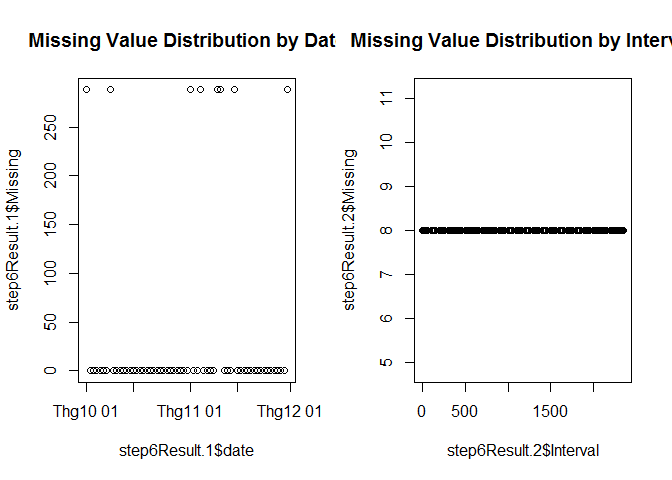
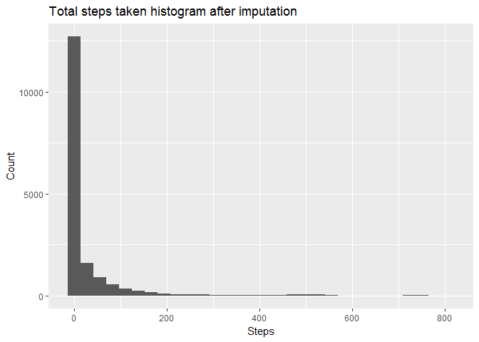
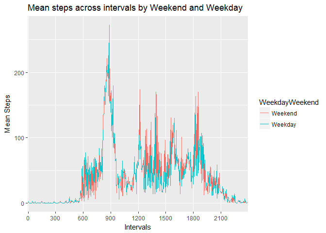

# Reproducible Research: Peer Assessment 1


## Step 1: Code for reading in the dataset and/or processing the data
## Read the activity data

```r
activityData<-read.csv("data/activity.csv")
```

Preprocessing the data

```r
# Use lubridate to transform the date column into date format
library(lubridate)
```

```
## Warning: package 'lubridate' was built under R version 3.3.2
```

```
## 
## Attaching package: 'lubridate'
```

```
## The following object is masked from 'package:base':
## 
##     date
```

```r
activityData$date <- ymd(activityData$date)
length(unique(activityData$date))
```

```
## [1] 61
```


##Step 2: Histogram of the total number of steps taken each day

```r
library(ggplot2)
```

```
## Warning: package 'ggplot2' was built under R version 3.3.2
```

```r
stepsByDate <- data.frame(tapply(activityData$steps, activityData$date, sum, na.rm=TRUE))
stepsByDate$date <- rownames(stepsByDate)
rownames(stepsByDate) <- NULL
names(stepsByDate)[[1]] <- "Total Steps"

#Histogram of total Steps by date
png("plot1.png")
ggplot(stepsByDate, aes(y=stepsByDate$`Total Steps`, x=stepsByDate$date)) + geom_bar(stat="identity", fill="#0000FF") + ylab("Steps") + xlab("Date (1/10/2012 - 30/11/2012") + ggtitle("Total Steps by date")
dev.off()
```

```
## png 
##   2
```

```r
ggplot(stepsByDate, aes(y=stepsByDate$`Total Steps`, x=stepsByDate$date)) + geom_bar(stat="identity", fill="#0000FF") + ylab("Steps") + xlab("Date (1/10/2012 - 30/11/2012") + ggtitle("Total Steps by date")
```

<!-- -->


##Step 3: Mean and median number of steps taken each day


```r
library(dplyr)
```

```
## Warning: package 'dplyr' was built under R version 3.3.2
```

```
## 
## Attaching package: 'dplyr'
```

```
## The following objects are masked from 'package:lubridate':
## 
##     intersect, setdiff, union
```

```
## The following objects are masked from 'package:stats':
## 
##     filter, lag
```

```
## The following objects are masked from 'package:base':
## 
##     intersect, setdiff, setequal, union
```

```r
step3Result <- data.frame(round(tapply(activityData$steps, activityData$date, mean, na.rm=TRUE), 2))
step3Result$date <- rownames(step3Result)
rownames(step3Result)<-NULL
names(step3Result)[[1]] <- "Mean Steps"
temp <- activityData %>% select(date, steps) %>% group_by(date) %>% summarise(median(steps))
names(temp)[[2]] <- "Median Steps"
step3Result$median<-temp$`Median Steps`
step3Result <- step3Result %>% select(date, `Mean Steps`, median)
```

##Step 4: Time series plot of the average number of steps taken

```r
step4Result <- step3Result
step4Result$date <- as.Date(step4Result$date, format="%Y-%m-%d")
ggplot(step4Result, aes(x=step4Result$date, y=step4Result$`Mean Steps`)) + geom_bar(stat="identity", fill="#0000FF") + scale_x_date() + ylab("Mean Steps Every day") + xlab("Date") + ggtitle("Mean Steps by Date")
```

```
## Warning: Removed 8 rows containing missing values (position_stack).
```

<!-- -->

```r
png("plot4.png")
ggplot(step4Result, aes(x=step4Result$date,y=step4Result$`Mean Steps`)) + geom_bar(stat="identity", fill="#0000FF") + scale_x_date() + ylab("Mean Steps Every day") + xlab("Date") + ggtitle("Mean Steps by Date")
```

```
## Warning: Removed 8 rows containing missing values (position_stack).
```

```r
dev.off()
```

```
## png 
##   2
```


##Step 5: The 5-minute interval that, on average, contains the maximum number of steps

```r
activityData$interval <- factor(activityData$interval)
step5Result <- aggregate(data=activityData, steps~date+interval, FUN="mean")
step5Result <- aggregate(data=step5Result, steps~interval, FUN="max")
```


##Step 6: Code to describe and show a strategy for imputing missing data
Missing values are replace by corresponding mean values

```r
step6Result <- activityData
step6Result$Missing <- is.na(step6Result$steps)
step6Result <- aggregate(data=step6Result,Missing~date+interval,FUN="sum")
step6Result.1 <- data.frame(tapply(step6Result$Missing,step6Result$date,sum))
step6Result.1$date <- rownames(step6Result.1)
rownames(step6Result.1)<-NULL
names(step6Result.1) <- c("Missing","date")
step6Result.1$date <- as.Date(step6Result.1$date,format="%Y-%m-%d")

step6Result.2 <- data.frame(tapply(step6Result$Missing,step6Result$interval,sum))
step6Result.2$date <- rownames(step6Result.2)
rownames(step6Result.2) <- NULL
names(step6Result.2) <- c("Missing","Interval")

par(mfrow=c(1,2))
plot(y=step6Result.1$Missing,x=step6Result.1$date,main="Missing Value Distribution by Date")
plot(y=step6Result.2$Missing,x=step6Result.2$Interval,main="Missing Value Distribution by Interval")
```

<!-- -->

```r
table(activityData$date)
```

```
## 
## 2012-10-01 2012-10-02 2012-10-03 2012-10-04 2012-10-05 2012-10-06 
##        288        288        288        288        288        288 
## 2012-10-07 2012-10-08 2012-10-09 2012-10-10 2012-10-11 2012-10-12 
##        288        288        288        288        288        288 
## 2012-10-13 2012-10-14 2012-10-15 2012-10-16 2012-10-17 2012-10-18 
##        288        288        288        288        288        288 
## 2012-10-19 2012-10-20 2012-10-21 2012-10-22 2012-10-23 2012-10-24 
##        288        288        288        288        288        288 
## 2012-10-25 2012-10-26 2012-10-27 2012-10-28 2012-10-29 2012-10-30 
##        288        288        288        288        288        288 
## 2012-10-31 2012-11-01 2012-11-02 2012-11-03 2012-11-04 2012-11-05 
##        288        288        288        288        288        288 
## 2012-11-06 2012-11-07 2012-11-08 2012-11-09 2012-11-10 2012-11-11 
##        288        288        288        288        288        288 
## 2012-11-12 2012-11-13 2012-11-14 2012-11-15 2012-11-16 2012-11-17 
##        288        288        288        288        288        288 
## 2012-11-18 2012-11-19 2012-11-20 2012-11-21 2012-11-22 2012-11-23 
##        288        288        288        288        288        288 
## 2012-11-24 2012-11-25 2012-11-26 2012-11-27 2012-11-28 2012-11-29 
##        288        288        288        288        288        288 
## 2012-11-30 
##        288
```


```r
# Dates that have missing values 
library(lubridate)
step6Result.3 <- as.data.frame(step6Result.1) %>% select(date,Missing) %>% arrange(desc(Missing))
step6Result.3 <- step6Result.3[which(step6Result.3$Missing!=0),]
step6Result.3$Weekday <- wday(step6Result.3$date,label=TRUE)
step6Result.4 <- activityData
step6Result.4$weekday <- wday(step6Result.4$date,label=TRUE)
#Finding the mean of steps every monday, and every interval
step6Result.5 <- aggregate(data=step6Result.4,steps~interval+weekday,FUN="mean",na.rm=TRUE)
#Merge the pre-imputation table step6Result.4 table with the average table step6Result.5
step6Result.6 <- merge(x=step6Result.4,y=step6Result.5,by.x=c("interval","weekday"),by.y=c("interval","weekday"),all.x=TRUE)
#Conditionally replacing the steps.x column NA value with the values from steps.y column value 
step6Result.6$Steps.Updated <- 0
for (i in 1:dim(step6Result.6)[[1]]){
if(is.na(step6Result.6[i,3])){ step6Result.6[i,6]=step6Result.6[i,5] }
else {step6Result.6[i,6]=step6Result.6[i,3]}
}
#Now simplify the imputed analytical data frame
step6Result.6 <- step6Result.6  %>% select(date,weekday,interval,Steps.Updated)
names(step6Result.6)[[4]] <- "Steps"
```


## Step 7: Histogram of the total number of steps taken each day after missing values are imputed


```r
png("plot7.png")
qplot(step6Result.6$Steps, geom="histogram", main="Total steps taken histogram after imputation", xlab="Steps", ylab="Count")
```

```
## `stat_bin()` using `bins = 30`. Pick better value with `binwidth`.
```

```r
dev.off()
```

```
## png 
##   2
```

```r
qplot(step6Result.6$Steps, geom="histogram", main="Total steps taken histogram after imputation", xlab="Steps", ylab="Count")
```

```
## `stat_bin()` using `bins = 30`. Pick better value with `binwidth`.
```

<!-- -->


## Step 8 Panel plot comparing the average number of steps taken per 5-minute interval across weekdays and weekends


```r
step8Result <- step6Result.6
levels(step8Result$weekday) <- c(1,2,3,4,5,6,7)
step8Result$WeekdayWeekend <- step8Result$weekday %in% c(1,2,3,4,5)
step8Result.1 <- aggregate(data=step8Result, Steps~interval+WeekdayWeekend, mean,na.rm=TRUE)
step8Result.1$WeekdayWeekend <- as.factor(step8Result.1$WeekdayWeekend)
levels(step8Result.1$WeekdayWeekend) <- c("Weekend","Weekday")

png("plot8.png")
ggplot(data=step8Result.1,aes(y=Steps, x=interval, group=1, color=WeekdayWeekend)) + geom_line() + scale_x_discrete(breaks = seq(0, 2500, by = 300)) + ylab("Mean Steps") + xlab("Intervals") + ggtitle("Mean steps across intervals by Weekend and Weekday")
dev.off()
```

```
## png 
##   2
```

```r
ggplot(data=step8Result.1, aes(y=Steps,x=interval,group=1,color=WeekdayWeekend)) + geom_line() + scale_x_discrete(breaks = seq(0, 2500, by = 300)) + ylab("Mean Steps") + xlab("Intervals") + ggtitle("Mean steps across intervals by Weekend and Weekday")
```

<!-- -->
